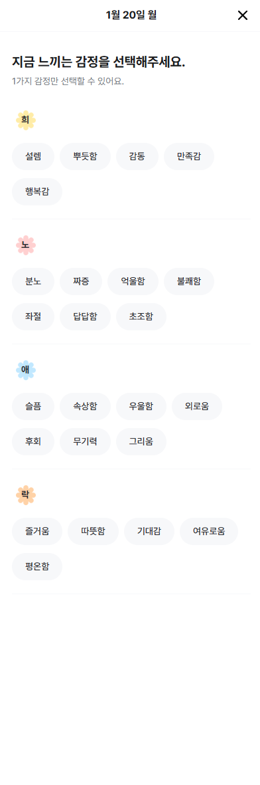
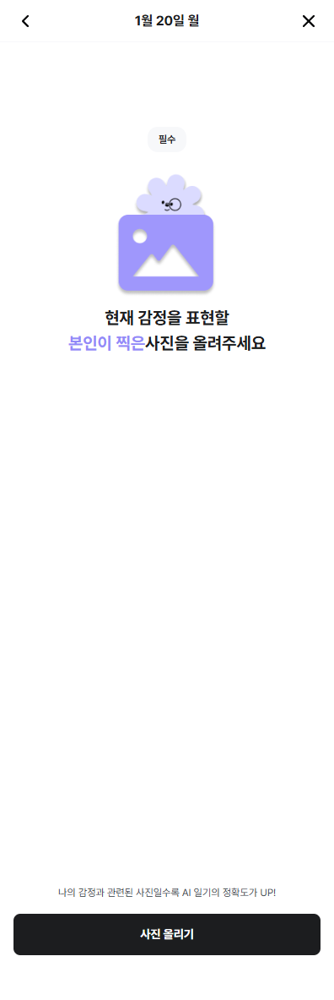
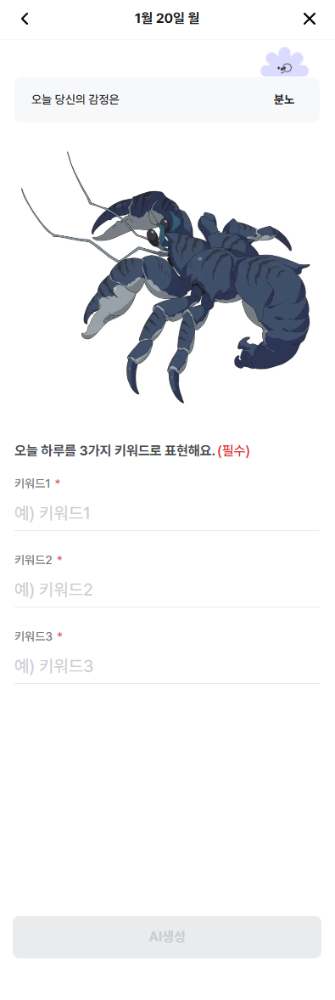
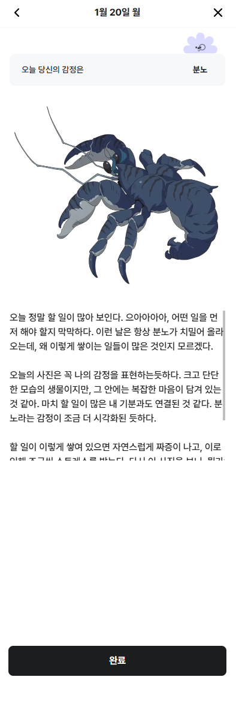
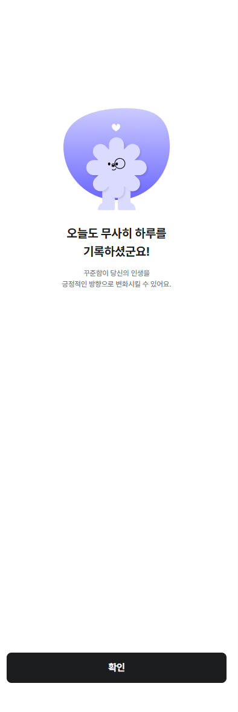
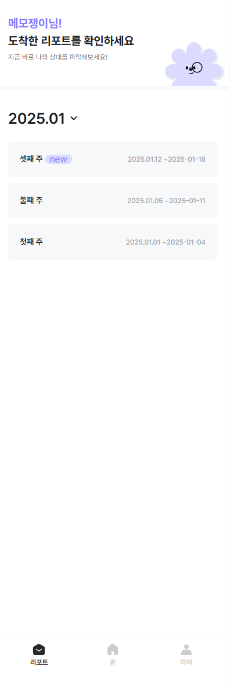
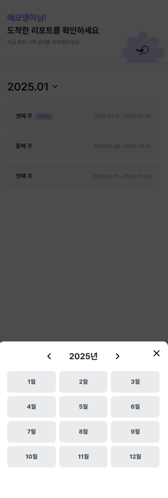
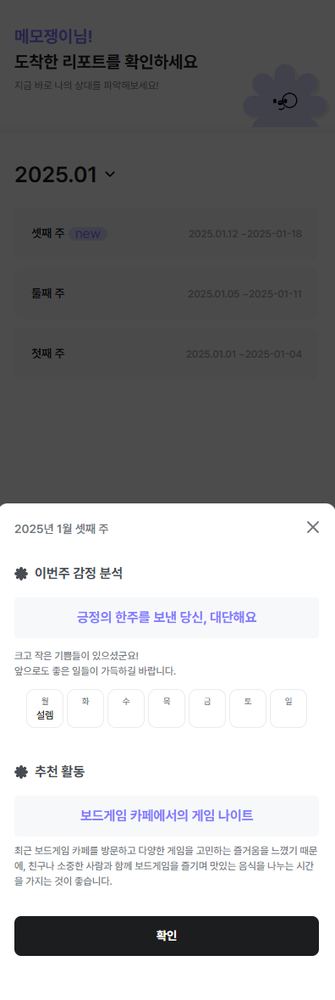

You can access the live demo of the project [here](https://www.kirolog.com/)

# Navigation
1. [Quick Start](#quickstart)
2. [Features](#features)
3. [BE Team](#beteam)

<a name="quickstart"></a>
# Quick Start
## 1. Create & activate a virtual environment
Make it in the root path
```
python -m venv .venv
source .venv/Scripts/activate   # Window
```
## 2. install requirements
```
pip install -r requirements.txt
```
## 3. Create environment variable file
Make it in the root path
```
touch .env
```
### - What should be in the file?
```
DEV_SECRET_KEY='YOUR_DEV_SECRET_KEY'
LOCAL_SECRET_KEY='YOUR_LOCAL_SECRET_KEY'
PROD_SECRET_KEY='YOUR_PROD_SECRET_KEY'
DEV_DB_NAME='YOUR_DEV_DB_NAME'
DEV_DB_USER='YOUR_DEV_DB_USER'
DEV_DB_PASSWORD='YOUR_DEV_DB_PASSWORD'
DEV_DB_HOST='YOUR_DEV_DB_HOST'
DEV_DB_PORT='YOUR_DEV_DB_PORT'
OPENAI_API_KEY='YOUR_OPENAI_API_KEY'
```
## 4. makemigrations & migrate
```
python manage.py makemigrations --settings=config.settings.the_execution_environment_you_want
python manage.py migrate --settings=config.settings.the_execution_environment_you_want
```
## 5. runserver
### Run as a production environment for real services
```
python manage.py runserver --settings=config.settings.prod
```
### Run in a development environment
```
python manage.py runserver --settings=config.settings.dev
```
### Run in a local environment
```
python manage.py runserver --settings=config.settings.local
```
### How to automate running environment settings
Enter in terminal
```
set DJANGO_SETTINGS_MODULE=config.settings.the_execution_environment_you_want
python manage.py runserver
```
## How to easily add initial data
```
python manage.py loaddata initial_data.json --settings=config.settings.the_execution_environment_you_want
python utils.py
```

<br><br><br>

<a name="features"></a>

# 핵심 기능
## AI 일기
> * 사용자는 감정 태그 1개를 선택하고 이미지 선택으로 넘어간다.
> * 사용자는 이미지 선택 후 키워드 3개를 입력한다.
> * 사용자는 태그/키워드/이미지 선택이 완료되면 AI생성 버튼으로 일기를 제공받는다.
> * 사용자는 AI생성 버튼으로 작성된 일기 수정을 마지막으로 일기 작성은 완료한다.

<details>
<summary>미리보기</summary>
<div markdown="1">
    






<br>
</div>
</details>

<br>

## AI 리포트
> * 사용자는 리포트 탭에서 주간 리포트를 제공받는다.
> * 리포트 탭은 월별로 확인 가능하며, 누적 건수는 확인이 불가하다.
> * 사용자는 리포트 탭에서 특정 리포트 컨테이너를 클릭할 경우, 바텀으로 정보를 제공받으며, 하단 확인 버튼으로 창을 닫는다.
> * 사용자는 주차별 리포트 우측에 기간을 확인할 수 있다.
> * 사용자는 주간 리포트에서 1) 이번주 감정 분석 2) 추천 활동을 제공받는다.

<details>
<summary>미리보기</summary>
<div markdown="1">
    




<br>
</div>
</details>

<br><br><br>

<a name="beteam"></a>

# 백엔드 Team
| **Name**         | **GitHub Handle**                          | **Responsibilities**                                                                                           |
|------------------|------------------------------------------------|-------------------------------------------------------------------------------------------|
| **Yongkyu Yeo**  | [@Dminus251](https://github.com/Dminus251)   | AI 일기 생성, AI 리포트 생성, 배포 등 |
| **Nahee Kim**  | [@sptcnl](https://github.com/sptcnl)   | 데이터 모델링, 회원 CRUD, 로그인/로그아웃, 일반 일기 CRUD, AI 일기 생성 API, AI 리포트 조회 API, API 서버 배포 등 |

<br><br><br>

#### [팀노션 바로가기](https://lowly-dart-7e6.notion.site/15175d35addb80eb86d2c706a20a2648)